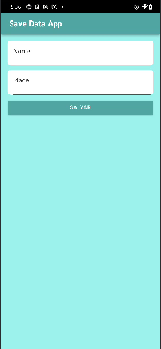
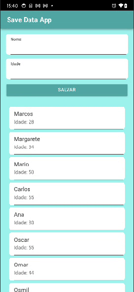

# 📱 Save Data App

<div align="center">
  
  
  
  
</div>

<p align="center">
  <strong>Aplicativo mobile para gerenciamento e armazenamento de dados pessoais</strong>
</p>

## 📋 Sobre o Projeto

O **Save Data App** é um aplicativo mobile desenvolvido com Ionic e Angular que permite aos usuários inserir, armazenar e visualizar dados pessoais de forma simples e eficiente. O app utiliza armazenamento local para garantir que os dados sejam salvos mesmo offline.

### ✨ Funcionalidades

- ✅ **Inserção de Dados**: Formulário simples para adicionar nome e idade
- ✅ **Armazenamento Local**: Dados salvos no dispositivo usando Capacitor Storage
- ✅ **Listagem Dinâmica**: Visualização de todos os dados salvos
- ✅ **Interface Responsiva**: Design adaptado para diferentes tamanhos de tela
- ✅ **Offline First**: Funciona sem conexão com internet

## 📱 Screenshots

<div align="center">
  
  
</div>

> **Funcionalidade**: O aplicativo permite inserir nome e idade, salvando automaticamente os dados que aparecem listados abaixo do formulário.

## 🎥 Demonstração

[saveData.webm](https://github.com/user-attachments/assets/838fbed4-a2e5-41bf-944f-36a1134de2ed)

## 🚀 Tecnologias Utilizadas

- **[Ionic Framework](https://ionicframework.com/)** - Framework para desenvolvimento mobile
- **[Angular](https://angular.io/)** - Framework para estrutura do front-end
- **[TypeScript](https://www.typescriptlang.org/)** - Linguagem principal de desenvolvimento
- **[Capacitor](https://capacitorjs.com/)** - Integração com funcionalidades nativas
- **[SCSS](https://sass-lang.com/)** - Estilização avançada
- **Capacitor Storage** - Armazenamento local de dados

## 📦 Instalação e Configuração

### Pré-requisitos

Certifique-se de ter instalado:

- [Node.js](https://nodejs.org/) (versão 16 ou superior)
- [Ionic CLI](https://ionicframework.com/docs/cli)
- [Angular CLI](https://angular.io/cli)

```bash
npm install -g @ionic/cli @angular/cli
```

### Instalação

1. **Clone o repositório**
```bash
git clone https://github.com/gc-marcos/saves-data-app.git
cd saves-data-app
```

2. **Instale as dependências**
```bash
npm install
```

3. **Execute o projeto**
```bash
ionic serve
```

### 📱 Executar no Dispositivo

**Para Android:**
```bash
ionic capacitor add android
ionic capacitor run android
```

**Para iOS:**
```bash
ionic capacitor add ios
ionic capacitor run ios
```

## 🏗️ Estrutura do Projeto

```
saves-data-app/
├── src/
│   ├── app/
│   │   ├── home/              # Página principal
│   │   ├── services/          # Serviços (Storage)
│   │   └── app.component.ts   # Componente raiz
│   ├── assets/                # Recursos estáticos
│   ├── theme/                 # Estilos globais
│   └── environments/          # Configurações de ambiente
├── android/                   # Projeto Android nativo
├── ios/                       # Projeto iOS nativo
└── capacitor.config.ts        # Configurações do Capacitor
```

## 🔧 Funcionalidades Detalhadas

### Armazenamento de Dados
- Utiliza **Capacitor Storage** para persistência local
- Dados salvos no formato JSON
- Funciona offline

### Interface do Usuario
- Design clean e intuitivo
- Componentes Ionic nativos
- Responsivo para diferentes dispositivos

## 🤝 Como Contribuir

1. Faça um **fork** do projeto
2. Crie uma nova **branch** para sua feature
```bash
git checkout -b feature/nova-funcionalidade
```

3. **Commit** suas mudanças
```bash
git commit -m "Adiciona nova funcionalidade"
```

4. **Push** para a branch
```bash
git push origin feature/nova-funcionalidade
```

5. Abra um **Pull Request**

## 📄 Licença

Este projeto está sob a licença MIT. Veja o arquivo [LICENSE](LICENSE) para mais detalhes.

## 👨‍💻 Autor

**Marcos Carvalho**
- GitHub: [@gc-marcos](https://github.com/gc-marcos)
- LinkedIn: [gc-marcos](https://linkedin.com/in/gc-marcos)
- Email: gcmarcoss@gmail.com

---

<div align="center">
  <p>Feito com ❤️ e Ionic</p>
  <p>⭐ Se este projeto te ajudou, deixe uma estrela!</p>
</div>
